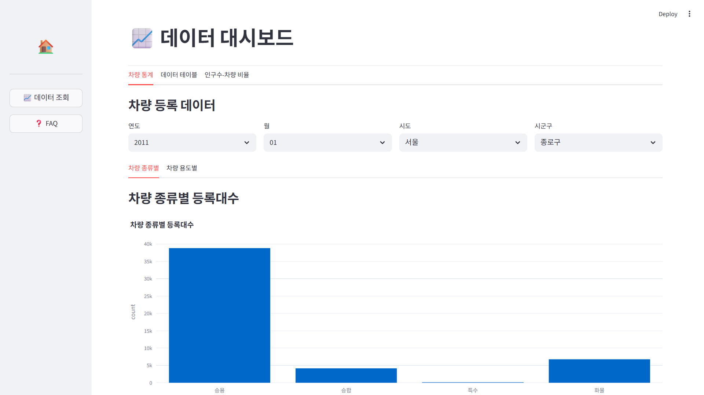

# 🚗 SKN20-1ST-2TEAM Bikini City

  
> **SK Networks Family AI Camp 20기 – 1차 프로젝트 산출물**  
> 데이터 기반 공공통계 분석과 크롤링 기반 고객지원 서비스 개선 연구  

---

## 😎 팀 소개  

<table>
  <tr>
    <td align="center">
      <br>
      <b>박준석</b><br>
      데이터 엔지니어<br>
      <sub>MOLIT API 처리, 시도별 데이터 분석</sub>
    </td>
    <td align="center">
      <br>
      <b>이도경</b><br>
      분석 담당<br>
      <sub>데이터 전처리, 테이블 명세서 작성</sub>
    </td>
    <td align="center">
      <br>
      <b>이성현</b><br>
      데이터베이스 담당<br>
      <sub>ERD 설계, DB 구축 및 연동</sub>
    </td>
    <td align="center">
      <br>
      <b>최유정</b><br>
      프론트엔드/UI<br>
      <sub>Streamlit 화면 설계 및 발표 자료 제작</sub>
    </td>
  </tr>
</table>


---

## 📌 프로젝트 개요  
본 프로젝트는 **국토교통부 자동차등록현황보고(시도별 데이터)** 와 **현대·기아자동차 FAQ 데이터**를 활용하여  
1) 국내 자동차 등록 현황의 지역별·차종별 특징을 분석하고,  
2) 기업 FAQ 체계의 문제점을 진단 및 개선 방안을 제시하는 것을 목표로 한다.  

---

## 🎯 목표  
- **공공 데이터 분석**: 시도별 자동차 등록 데이터를 정규화 및 DB 적재  
- **기업 FAQ 크롤링**: 현대·기아 FAQ 자동 수집 및 텍스트 정제  
- **문제점 진단**: 데이터 활용성 제약·FAQ 최신성 부족  
- **개선 제안**: 통합 대시보드·AI FAQ 자동응답 체계  

---

## 📂 프로젝트 구조  
```bash
├── data/                  # 수집 및 전처리 데이터 (CSV)
│   ├── CAR_REGIST_SIDO.csv
│   └── hyundai_faq_all.csv
│
├── src/                   # 코드 구현
│   ├── car_regist_api.py    # MOLIT 자동차 등록 API 수집/DB 적재
│   ├── hyundai_faq_crawl.py # 현대 FAQ 크롤링 코드
│   └── kia_faq_crawl.py     # 기아 FAQ 크롤링 코드
│
├── report/                # 보고서 (Markdown/PDF)
│   └── 1차_프로젝트_보고서.pdf
│
├── visualization/         # 분석 결과 시각화 (추가 예정)
│
└── README.md              # 프로젝트 개요 및 실행 가이드
````

---

## 🛠 기술 스택

* **데이터 수집**: `requests`, `selenium`, `webdriver-manager`
* **데이터 처리**: `pandas`, `sqlalchemy`, `pymysql`
* **DBMS**: MySQL
* **환경 관리**: `dotenv` (.env 파일로 DB 연결 정보 관리)
* **시각화(예정)**: matplotlib, seaborn

---

## 📊 데이터 분석 과정

### 🔹 자동차 등록 현황 (시도별)

* 국토교통부 **자동차등록현황보고 (form\_id=5498)** API 활용
* 2011년 \~ 2025년 데이터 수집
* 전처리:

  * `sido` 단위만 활용
  * 불필요한 집계행(“계”) 제거
  * 차종(승용·승합·화물·특수), 사용구분 컬럼 정규화
* MySQL 테이블(`CAR_REGIST_SIDO`)에 적재

### 🔹 기업 FAQ 크롤링

* 현대자동차 공식 FAQ 페이지 → Selenium 기반 크롤링
* 카테고리·질문·답변 구조로 추출 → CSV 저장 (`hyundai_faq_all.csv`)
* 기아자동차 FAQ 페이지도 동일한 방식 적용

---

## 📈 주요 결과

1. **자동차 등록 현황**

   * 시도별 등록 대수에서 수도권 집중 현상 뚜렷
   * 전기차·친환경차의 등록 비중 지속 상승
2. **FAQ 분석**

   * 현대·기아 FAQ는 항목이 풍부하나 최신성·중복 문제 존재
   * 사용자 중심 분류 체계가 미흡 → 고객 불편 초래

---
## 🗂️ ERD  

<p align="center">
  
</p>

---

## 🖥️ Streamlit 시연 화면  

  
  
  


---

## 💡 개선 제안

* **공공데이터**: 시각화 대시보드 제공, 비전문가 활용성 확대
* **FAQ 체계**: AI 기반 자동응답(챗봇) 도입, 중복 질문 제거
* **통합 플랫폼**: 자동차 등록 현황 + FAQ 데이터를 연결한 서비스 모델 제안

---

## 📅 WBS (Work Breakdown Structure)

| 작업명                    | 시작일        | 종료일        | 담당자      | 산출물                    |
| ---------------------- | ---------- | ---------- | -------- | ---------------------- |
| 프로젝트 주제 선정             | 2025-09-22 | 2025-09-22 | ALL      | -                      |
| 차량 현황 데이터 수집              | 2025-09-22 | 2025-09-23 | ALL      | CSV                    |
| FAQ 데이터 크롤링 (현대, 기아)   | 2025-09-23 | 2025-09-24 | 박준석,최유정 | CSV                    |
| ERD 설계                 | 2025-09-24 | 2025-09-24 | 이도경      | ERD 다이어그램              |
| 전체 데이터 DB 구축 및 연동 | 2025-09-22 | 2025-09-25 | ALL      | DB 테이블                 |
| 모듈화                    | 2025-09-24 | 2025-09-25 | 이성현      | insert, crawling, data |
| 테이블 명세서                | 2025-09-24 | 2025-09-25 | 최유정      | 테이블 명세서                |
| UI 화면 설계               | 2025-09-23 | 2025-09-25 | ALL      | Streamlit 화면           |
| UI 구현 - 홈 화면           | 2025-09-23 | 2025-09-25 | 이도경      | Streamlit 화면           |
| UI 구현 - 연도별 현황 화면   | 2025-09-23 | 2025-09-25 | 이성현,이도경 | Streamlit 화면           |
| UI 구현 - FAQ 화면         | 2025-09-23 | 2025-09-25 | 이성현 | Streamlit 화면           |
| 데이터 가공 및 UI 구현  | 2025-09-23 | 2025-09-24 | 박준석, 최유정 | Streamlit 화면           |
| 데이터 차트 표시              | 2025-09-23 | 2025-09-25 | ALL      | 데이터 차트                 |
| 데이터 출력                 | 2025-09-23 | 2025-09-25 | ALL      | 데이터 차트                 |
| 발표 자료                  | 2025-09-24 | 2025-09-25 | 최유정      | PPT                    |
| 문서 작업 및 발표 준비          | 2025-09-24 | 2025-09-25 | 박준석,최유정      | 최종 보고서                 |
| 프로젝트 자체 평가 및 회고           | 2025-09-25 | 2025-09-25 | ALL      | -                      |

---

## 📚 참고자료

* 국토교통부. (2024). *자동차등록현황보고 (Total Registered Motor Vehicles)*. [https://stat.molit.go.kr](https://stat.molit.go.kr)
* 현대자동차. (2025). *FAQ 페이지*. [https://www.hyundai.com/kr/ko/faq.html](https://www.hyundai.com/kr/ko/faq.html)
* 기아자동차. (2025). *FAQ 페이지*. [https://www.kia.com/kr/customer/faq](https://www.kia.com/kr/customer/faq)

---

## 🏆 기대 효과

본 프로젝트는 공공 데이터와 기업 FAQ를 통합적으로 분석하여

* **행정 효율성 제고**
* **고객 경험 개선**
* **AI 기반 서비스 확장 가능성**
  을 제시했다는 점에서 **데이터 기반 정책·산업 혁신**에 기여할 수 있다.

---

## 🙌 팀원 회고

**박준석**  
> 열정가득한 팀원들과 프로젝트의 진행을 간략하게나마 기획부터 구현까지 경험할 수 있어서 좋았습니다.  
> 서로 모르는 부분을 메꿔가는 협업의 순기능을 몸소 느끼며 많이 성장할 수 있던 기회였습니다.  
> 앞으로 더 정진하여 팀에 더 많은 기여를 할 수 있는 팀원이 되도록 하겠습니다.  

**이도경**  
> 프로젝트를 진행하며, 끝없는 오류에 좌절하기도 했지만,  
> 마침내 코드가 정상 작동하는 순간의 짜릿함과 성취감을 느꼈습니다.  

**이성현**  
> 팀 프로젝트를 하면서 협업의 중요성과 필요성을 알게 되었습니다.  
> 이 경험을 바탕으로 다른 팀 프로젝트를 하더라도 더 많은 기여를 하고 더 잘하는 팀원이 될 자신이 생겼습니다.  

**최유정**  
> 첫 번째 프로젝트를 통해 단순히 데이터를 수집하고 분석하는 수준을 넘어서, 데이터를 실제 서비스 형태로 구현하고 시각화하는 전 과정을 경험할 수 있어 매우 뜻깊었습니다.
> 짧은 기간 동안 기획부터 구현, 그리고 발표 준비까지 모두 함께 하면서 어려움도 많았지만, 그 과정 속에서 데이터의 가치를 현실에 적용하는 방법을 몸소 배울 수 있었습니다. 밤늦게까지 함께 고민하고 노력해주신 준석님, 도경님, 성현님께 깊은 감사드립니다.

